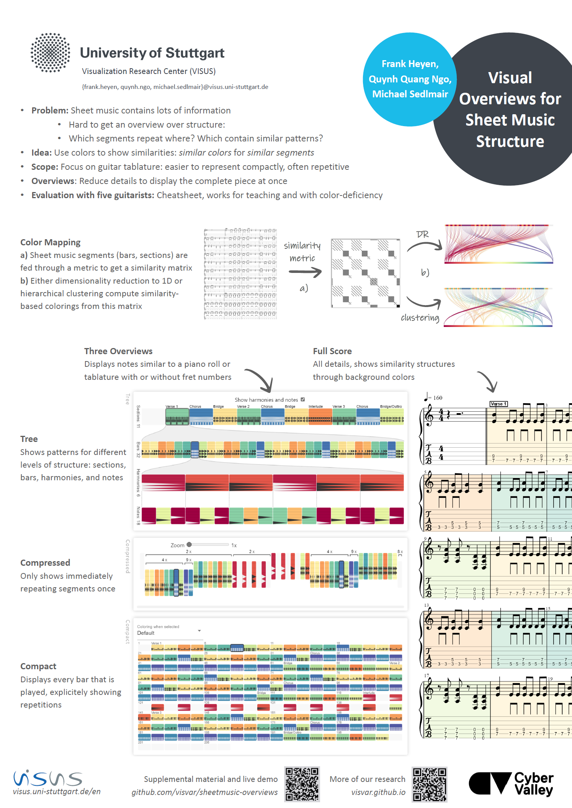

# Visual Overviews for Sheet Music Structure

Live web app at [visvar.github.io/sheetmusic-overviews](https://visvar.github.io/sheetmusic-overviews/).
Try out one of the example files in [examples/](./examples/).

Please see our [ISMIR 2023](https://ismir2023program.ismir.net/poster_216.html) [paper](./media/paper.pdf), [poster](./media/poster.pdf), [video](https://youtu.be/zvok5W4p8oo), and [supplemental material](./media/supplemental.pdf) for more details.
See also [this notebook](https://observablehq.com/@fheyen/colored-tablature) and this [example for lyrics](https://observablehq.com/@fheyen/colored-lyrics)!

You might also be interested in our [ISMIR late-breaking demo on visual guitar tab comparison](https://github.com/visvar/visual-guitar-tab-comparison/)!

More research on our website [visvar.github.io](https://visvar.github.io/).

## Running Locally

You need to have NodeJS and npm or pnpm installed.

- `npm i`
- `npm start`

Open the URL shown in the console in your browser.
